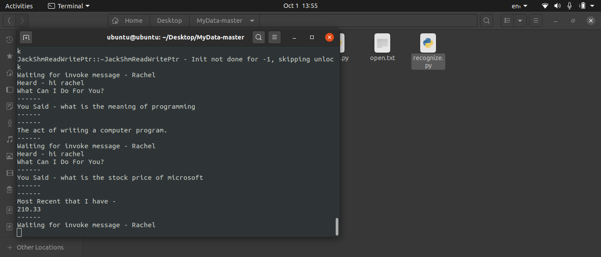
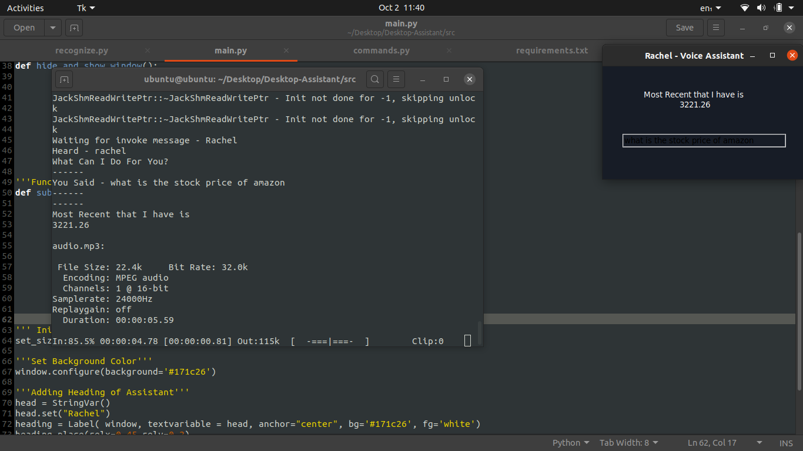

# Desktop-Assistant
Hi, here is the code for the Desktop Assistant(Rachel) I created as a personal project. Hope you like it!

## Setup and Run  
Navigate to ./src  
python3 main.py  

## Highlights  
Made on python with Tkinter UI, thus compatible with MacOS, Windows, and Ubuntu.  
Call Ben and make it do tasks.  
Currently implemented to do basic tasks - dictionary, application launch, stock values, shell commands etc.  
All the commands are configurable and can be edited in features with just the modification of text files.  
You can add new commands easily with commands.py.

## Screenshots  

